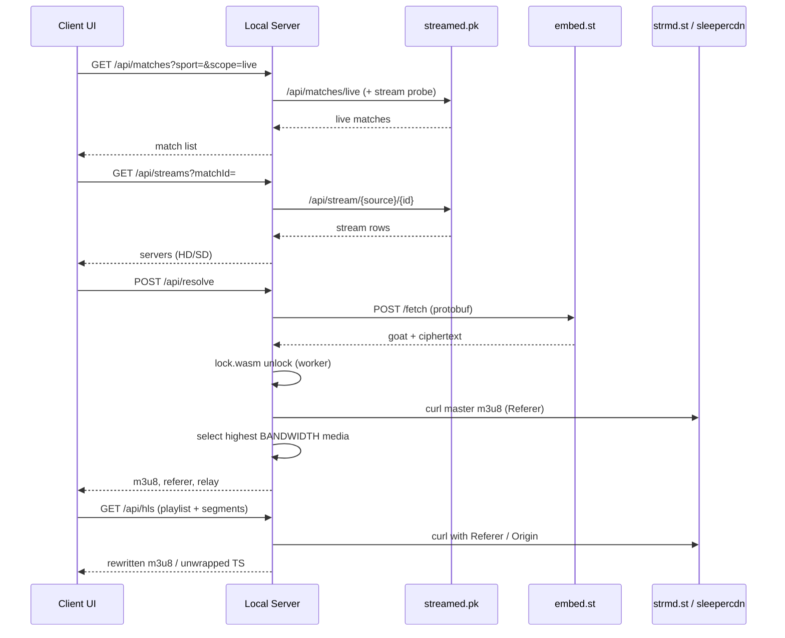

# Streamed.pk HLS Stream Resolver

Self-hosted **HLS stream resolver** for [streamed.pk](https://streamed.pk) live sports. It turns match and server selection into a playable **m3u8** playlist by replaying the [embed.st](https://embed.st) client handshake, decrypting the GOAT `/fetch` response with `lock.wasm`, and serving a local **HLS proxy** that injects the required Referer while unwrapping sleepercdn **WEBP** segments into raw **MPEG-TS**.

The browser UI plays through [hls.js](https://github.com/video-dev/hls.js). The same resolve response exports a direct CDN playlist plus ready-made **VLC** and **mpv** commands when you want an external player instead of the built-in page.

Requires **Node.js** with ESM support, **`curl` on `PATH`**, and network access to streamed.pk, embed.st, and the upstream CDN.

## Table of Contents

- [Why This Exists](#why-this-exists)
- [Quick Start](#quick-start)
- [Using the App](#using-the-app)
- [Architecture](#architecture)
- [Resolve Pipeline](#resolve-pipeline)
- [HLS Proxy and Playback](#hls-proxy-and-playback)
- [HTTP API](#http-api)
- [Configuration](#configuration)
- [Project Layout](#project-layout)
- [Stack](#stack)
- [Limits](#limits)
- [Disclaimer](#disclaimer)

## Why This Exists

A streamed.pk watch page is not a stream. It lists live sports matches and points each server (Admin, Alpha, Golf, and the rest) at an **embed.st** player. The real **HLS playlist URL never appears in HTML**. The official player posts a protobuf body to embed.st `/fetch`, reads a `goat` header, runs **WASM** unlock, then requests a tokenized CDN **m3u8** (typically `*.strmd.st`) with `Referer: https://embed.st/`.

Bare Node `fetch` against that CDN often returns **403**. Segment hosts on sleepercdn wrap MPEG-TS inside a **RIFF/WEBP** container (EXIF payload), so a naive proxy that forwards bytes as `video/mp2t` will buffer forever or fail decode. This resolver copies the official path end to end: catalog → unlock → highest-bandwidth media playlist → curl-backed relay with streaming unwrap → browser or VLC/mpv.

## Quick Start

```bash
npm install
npm start
```

Open [http://localhost:3000](http://localhost:3000). The start script builds TypeScript, frees the port, and runs `dist/server/main.js`.

Useful scripts:

| Command | What It Does |
| --- | --- |
| `npm start` | Build, restart listener, serve UI + API |
| `npm run build` | Compile server and client into `dist/` |
| `npm run typecheck` | Type-check without emitting |

Default listen port is `3000`. Override with `PORT`.

## Using the App

The home page is a three-column live sports workspace:

1. **Matches** — live events for the selected sport (or All), filtered to feeds that still expose streams.
2. **Player** — stage title, resolve / first-frame timing, hls.js playback, and copy fields for Direct, Proxied, VLC, and mpv.
3. **Servers** — sources for the selected match (HD/SD, language, viewers). Click a stream to resolve and play.

Flow is always match → server → play. Resolve does not run until a server chip is chosen. After a successful unlock, the proxied URL drives the in-page player; the Direct URL is the CDN media playlist (usually `high/mono.m3u8`) intended for players that can send the embed Referer.

Example external playback (values come from the export panel after resolve):

```bash
vlc --http-referrer 'https://embed.st/' 'https://lb….strmd.st/…/high/mono.m3u8'
mpv --referrer='https://embed.st/' 'https://lb….strmd.st/…/high/mono.m3u8'
```

If the player cannot set Referer headers, use the **Proxied** `/api/hls` link instead — the local server attaches headers and rewrites nested playlist and segment URLs.

## Architecture

Three upstream layers sit behind one local origin:

| Layer | Origin | Role |
| --- | --- | --- |
| Catalog | streamed.pk | Sports, live matches, per-source stream lists |
| Unlock | embed.st | Protobuf `/fetch`, `goat` header, `lock.wasm` decrypt |
| Media | `*.strmd.st`, sleepercdn | Master/media m3u8 and WEBP-wrapped MPEG-TS segments |



Golf servers take a different embed hop (third-party iframe → ingest slot) before the same GOAT unlock. Everything else shares the HLS proxy path.

## Resolve Pipeline

`POST /api/resolve` accepts either a match-bound selection or a direct source slot:

| Body | Meaning |
| --- | --- |
| `matchId` + `source` + `stream` | Look up the match, pick that source’s `streamNo` |
| `source` + `id` + `stream` | Resolve without browsing the live list |

Steps after input validation (`src/handlers/resolve.ts`):

1. Build an embed **slot** (`source` / `id` / `stream` → `embed.st/embed/...`).
2. **Golf** → `unlockGolf` maps to an ingest slot; other sources → `resolveGoat`.
3. GOAT path encodes a protobuf body (`src/goat/proto.ts`), `POST`s embed.st `/fetch` (`src/goat/fetch.ts`), and decrypts in a worker thread with happy-dom + vendored `lock.wasm` (`src/goat/lock.ts`, `src/goat/lock-worker.ts`).
4. Pull the unlocked playlist with curl; if it is a master, **select the highest `BANDWIDTH` media URI** (official JW player starts on `high/mono.m3u8`).
5. Return `m3u8`, `referer` (`https://embed.st/`), and `relay` (`/api/hls?url=&referer=`).

Tokens are live and short-lived. Nothing is cached on disk.

## HLS Proxy and Playback

`GET /api/hls` (`src/proxy/hls.ts`) is the referer-aware **HLS proxy**:

- Upstream pulls go through **curl** (`src/proxy/pull.ts`) with browser User-Agent, `Referer`, and `Origin` — required because Node TLS fingerprints are blocked on the CDN.
- Playlists are rewritten so every media URI and `URI="…"` attribute loops back through `/api/hls`.
- sleepercdn segment URLs stream with `curl -N`: parse the WEBP header early, emit EXIF MPEG-TS as soon as length is known, and kill the curl child when the TS body is complete (`pullGoatSegmentStream`).
- Non-streaming fallbacks still unwrap full buffers via `unwrapGoatSegment` (RIFF/WEBP → EXIF → 188-byte TS packets).

The HTTP server pipes response bodies (`src/server/main.ts`) instead of buffering `arrayBuffer()`, so first-byte latency tracks upstream TTFB rather than full segment download time.

The client HLS config mirrors the official embed numbers: `maxBufferSize: 0`, `maxBufferLength: 10`, `liveSyncDurationCount: 7`.

## HTTP API

All JSON and HLS routes share the same process as the static UI.

### `GET /api/sports`

Proxies streamed.pk `/api/sports`. Returns `[{ id, name }, …]`.

### `GET /api/matches`

| Query | Behavior |
| --- | --- |
| `sport=all` (or a category) + `scope=live` | Live list from `/api/matches/live`, optionally filtered by category, dropping matches with empty stream probes |
| `scope=popular` / `scope=all` | streamed.pk popular or full sport lists |
| missing `sport` or `sport=live-popular` | `/api/matches/live/popular` |

### `GET /api/streams`

| Query | Behavior |
| --- | --- |
| `matchId=` | All sources for that match, ranked, with `sourceName` / `sourceDescription` |
| `source=` + `id=` | Single-source stream list |

### `POST /api/resolve`

Request body (JSON):

```json
{
  "matchId": "leeds-united-vs-newcastle-united-2494036",
  "source": "admin",
  "stream": 1
}
```

or:

```json
{
  "source": "admin",
  "id": "ppv-leeds-united-vs-newcastle-united",
  "stream": 1
}
```

Success shape:

```json
{
  "ok": true,
  "matchId": "…",
  "title": "…",
  "source": "admin",
  "stream": "1",
  "embedUrl": "https://embed.st/embed/…",
  "m3u8": "https://lb….strmd.st/…/high/mono.m3u8",
  "referer": "https://embed.st/",
  "relay": "http://localhost:3000/api/hls?url=…&referer=…"
}
```

Failures return `{ "ok": false, "stage": "input"|"resolve", "error": "…" }`.

### `GET /api/hls`

| Query | Required | Role |
| --- | --- | --- |
| `url` | yes | Upstream playlist or segment URL |
| `referer` | yes | Usually `https://embed.st/` |

Returns rewritten `application/vnd.apple.mpegurl` or `video/mp2t`.

## Configuration

Environment variables (`src/config/site.ts`):

| Variable | Default | Purpose |
| --- | --- | --- |
| `PORT` | `3000` | HTTP listen port |
| `STREAMED_ORIGIN` | `https://streamed.pk` | Catalog API origin |
| `EMBED_ORIGIN` | `https://embed.st` | Unlock / Referer origin |
| `USER_AGENT` | Chrome-like desktop UA | Shared on streamed.pk fetch and curl CDN pulls |

Source display names, descriptions, and sort tiers live in `src/config/sources.ts` (Admin through Intel).

## Project Layout

```
src/
  api/           streamed.pk HTTP client (sports, live, streams, match lookup)
  client/        Poppins UI (HTML/CSS) + TypeScript app (hls.js player)
  config/        site origins and source catalog
  goat/          protobuf fetch, lock.wasm worker, golf → ingest, vendor WASM
  handlers/      catalog + resolve HTTP handlers
  proxy/         curl pull, media playlist select, HLS rewrite, WEBP unwrap
  server/        Node HTTP entry, router, static client files
  types/         shared models (Match, StreamLink, ResolveResult, Slot)
```

Build output lands in `dist/` (gitignored). Scratch RE artifacts stay in local `tmp/` (excluded via `.git/info/exclude`, not committed).

## Stack

| Piece | Choice |
| --- | --- |
| Language | TypeScript (ESM, NodeNext server + bundler client) |
| Runtime | Node.js `http` + Web `Request`/`Response` |
| Unlock | happy-dom + worker_threads + vendored `lock.wasm` / `lock-esm.mjs` |
| Math helper | `big-integer` (WASM glue) |
| CDN transport | `curl` (keep-alive-friendly streaming for segments) |
| Player | hls.js from jsDelivr |

## Limits

- Scope is **streamed.pk / embed.st** (including Golf’s third-party hop). Other aggregators use different unlock chains.
- Live stream tokens expire; resolve again when playback dies.
- Matches must still exist on streamed.pk live/all endpoints for `matchId` resolve.
- **curl** is mandatory for CDN and playlist pulls; do not expect plain `fetch` to replace it without a fingerprint strategy.
- The local relay is for localhost / trusted networks — it does not add auth.

## Disclaimer

This project is for research, interoperability, and personal playback against publicly reachable streamed.pk / embed.st endpoints. Respect upstream terms of service, copyright, and local law. Do not use it to redistribute or monetize streams you are not authorized to carry.
